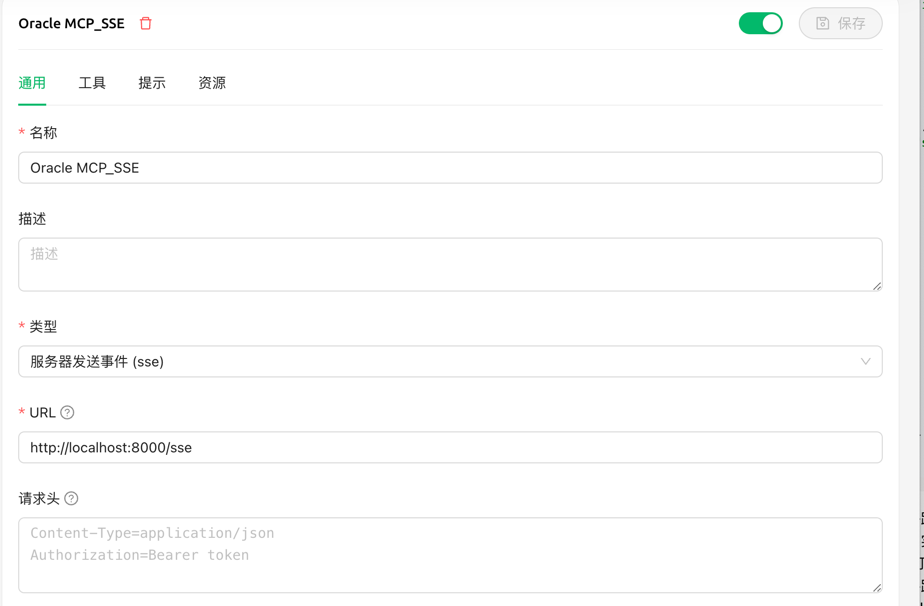

# MCP 服务器 - Oracle 数据库上下文

[English](README.md) | [中文](README-zh.md)

一个强大的模型上下文协议（MCP）服务器，为大型 Oracle 数据库提供上下文数据库模式信息，使 AI 助手能够理解和操作包含数千张表的数据库。

## 目录
- [概述](#概述)
- [功能](#功能)
- [使用方法](#使用方法)
   - [在 VSCode Insiders 中集成 GitHub Copilot](#在-vscode-insiders-中集成-github-copilot)
      - [选项 1：使用 Docker（推荐）](#选项-1使用-docker推荐)
      - [选项 2：使用 UV（本地安装）](#选项-2使用-uv本地安装)
   - [本地启动服务器](#本地启动服务器)
   - [可用工具](#可用工具)
- [架构](#架构)
- [连接模式](#连接模式)
   - [Thin 模式（默认）](#thin-模式默认)
   - [Thick 模式](#thick-模式)
- [系统要求](#系统要求)
- [性能注意事项](#性能注意事项)
- [贡献](#贡献)
- [许可证](#许可证)
- [支持](#支持)

## 概述

MCP Oracle DB Context 服务器解决了在处理超大型 Oracle 数据库时的一个关键难题：如何为 AI 模型提供准确、相关的数据库模式信息，而不会因成千上万的表和关系而使其不堪重负。

通过智能缓存和提供数据库模式信息，该服务器允许 AI 助手：
- 按需查找特定表的结构
- 按模式搜索表
- 理解表之间的关系和外键
- 获取数据库厂商信息

## 功能

- **智能模式缓存**：构建并维护本地数据库模式缓存，减少数据库查询
- **有针对性的结构查找**：无需加载整个数据库结构即可检索特定表的结构
- **表搜索**：通过名称模式匹配查找表
- **关系映射**：理解表之间的外键关系
- **Oracle 数据库支持**：专为 Oracle 数据库设计
- **MCP 集成**：可与 VSCode、Claude、ChatGPT 等支持 MCP 的 AI 助手无缝协作

## 使用方法

### 在 VSCode Insiders 中集成 GitHub Copilot

要在 VSCode Insiders 中将此 MCP 服务器与 GitHub Copilot 一起使用，请按照以下步骤操作：

1. **安装 VSCode Insiders**
   - 下载并安装最新版本的 [VSCode Insiders](https://code.visualstudio.com/insiders/)

2. **安装 GitHub Copilot 扩展**
   - 打开 VSCode Insiders
   - 进入扩展市场
   - 搜索并安装"GitHub Copilot"

3. **配置 MCP 服务器**
   - **推荐：[使用 Docker](#选项-1使用-docker推荐)**
   - 备选：[使用 UV](#选项-2使用-uv本地安装)

4. **启用 Agent 模式**
   - 在 VSCode Insiders 中打开 Copilot 聊天
   - 点击"Copilot Edits"
   - 选择"Agent mode"
   - 在聊天输入框点击刷新按钮以加载可用工具

完成上述步骤后，您将可以通过 GitHub Copilot 聊天界面访问所有数据库上下文工具。

#### 选项 1：使用 Docker（推荐）

在 VSCode Insiders 的用户或工作区 `settings.json` 文件中添加如下内容：

   ```json
   "mcp": {
       "inputs": [
        {
          "id": "db-password",
          "type": "promptString",
          "description": "Oracle DB Password",
          "password": true,
        }
      ],
       "servers": {
           "oracle": {
               "command": "docker",
               "args": [
                   "run",
                   "-i",
                   "--rm",
                   "-e",
                   "ORACLE_CONNECTION_STRING",
                   "-e",
                   "TARGET_SCHEMA",
                   "-e",
                   "CACHE_DIR",
                   "-e",
                   "THICK_MODE",
                   "dmeppiel/oracle-mcp-server"
               ],
               "env": {
                  "ORACLE_CONNECTION_STRING":"<db-username>/${input:db-password}@<host>:1521/<service-name>",
                  "TARGET_SCHEMA":"",
                  "CACHE_DIR":".cache",
                  "THICK_MODE":"",  // 可选：设置为 "1" 以启用 thick 模式
                  "ORACLE_CLIENT_LIB_DIR":"" // 可选：如果使用 thick 模式并且想要设置非默认的客户端库目录
               }
           }
       }
   }
   ```

   使用 Docker（推荐方式）：
   - 所有依赖项都包含在容器中
   - 如需启用 thick 模式，在环境变量中设置 `THICK_MODE=1`
   - 如果使用 `THICK_MODE`，可以通过 `ORACLE_CLIENT_LIB_DIR` 来设置 Oracle 客户端库的安装路径（如果与默认位置不同）

#### 选项 2：使用 UV（本地安装）
   
   此选项需要在本地安装和设置项目：

   1. **前置条件**
      - Python 3.12 或更高版本
      - Oracle 数据库访问权限
      - Oracle instant client（`oracledb` Python 包所需）

   2. **安装 UV**
      ```bash
      # 使用 curl 安装 uv（macOS/Linux）
      curl -LsSf https://astral.sh/uv/install.sh | sh

      # 或使用 PowerShell（Windows）
      irm https://astral.sh/uv/install.ps1 | iex
      ```
      安装 uv 后请重启终端。

   3. **项目设置**
      ```bash
      # 克隆仓库
      git clone https://github.com/yourusername/oracle-mcp-server.git
      cd oracle-mcp-server

      # 创建并激活虚拟环境
      uv venv
      
      # 激活（Unix/macOS）
      source .venv/bin/activate
      
      # 激活（Windows）
      .venv\Scripts\activate

      # 安装依赖
      uv pip install -e .
      ```

   4. **配置 VSCode 设置**
      ```json
      "mcp": {
         "inputs": [
            {
               "id": "db-password",
               "type": "promptString",
               "description": "Oracle DB Password",
               "password": true,
            }
         ],
         "servers": {
            "oracle": {
                  "command": "/path/to/your/.local/bin/uv",
                  "args": [
                     "--directory",
                     "/path/to/your/oracle-mcp-server",
                     "run",
                     "main.py"
                  ],
                  "env": {
                     "ORACLE_CONNECTION_STRING":"<db-username>/${input:db-password}@<host>:1521/<service-name>",
                     "TARGET_SCHEMA":"",
                     "CACHE_DIR":".cache",
                     "THICK_MODE":"",  // 可选：设置为 "1" 以启用 thick 模式
                     "ORACLE_CLIENT_LIB_DIR":"" // 可选：如果使用 thick 模式并且想要设置非默认的客户端库目录
                  }
            }
         }
      }
      ```
   - 请将路径替换为实际的 uv 可执行文件路径和 oracle-mcp-server 目录路径

两种方式均需：
- 将 `ORACLE_CONNECTION_STRING` 替换为实际的数据库连接字符串
- `TARGET_SCHEMA` 可选，默认为当前用户的 schema
- `CACHE_DIR` 可选，默认为 MCP 服务器根目录下的 `.cache`

#### 选项 3：使用 Cherry Studio
通过uv方式运行


通过sse方式运行


### 本地启动服务器

直接运行 MCP 服务器：

```bash
uv run main.py

python main.py --transport=sse

```

开发和测试：

```bash
# 安装 MCP Inspector
uv pip install mcp-cli

# 使用 MCP Inspector 测试
mcp dev main.py

# 或安装到 Claude Desktop
mcp install main.py
```

### 可用工具

当通过 VSCode Insiders、Claude 等 AI 助手连接时，以下工具可用：

#### `get_table_schema`
获取指定表的详细结构信息，包括列、数据类型、可空性和关系。
示例：
```
请展示 EMPLOYEES 表的结构。
```

#### `get_tables_schema`
一次获取多个表的结构信息。比多次调用 get_table_schema 更高效。
示例：
```
请同时提供 EMPLOYEES 和 DEPARTMENTS 两个表的结构。
```

#### `search_tables_schema`
按名称模式搜索表并获取其结构。
示例：
```
查找所有可能与客户相关的表并展示其结构。
```

#### `rebuild_schema_cache`
强制重建结构缓存。请谨慎使用，此操作资源消耗较大。
示例：
```
数据库结构已更改。请重建结构缓存。
```

#### `get_database_vendor_info`
获取已连接 Oracle 数据库的版本和 schema 信息。
示例：
```
我们正在运行哪个版本的 Oracle 数据库？
```

#### `search_columns`
查找包含特定字段的表。当你知道需要的数据但不确定在哪些表时很有用。
示例：
```
哪些表包含 customer_id 相关的字段？
```

#### `get_pl_sql_objects`
获取 PL/SQL 对象（如过程、函数、包、触发器等）信息。
示例：
```
展示所有以 'CUSTOMER_' 开头的存储过程。
```

#### `get_object_source`
获取 PL/SQL 对象的源代码。便于调试和理解数据库逻辑。
示例：
```
请展示 CUSTOMER_UPDATE_PROC 过程的源代码。
```

#### `get_table_constraints`
获取表的所有约束（主键、外键、唯一约束、检查约束等）。
示例：
```
ORDERS 表定义了哪些约束？
```

#### `get_table_indexes`
获取表的所有索引，有助于查询优化。
示例：
```
请展示 CUSTOMERS 表的所有索引。
```

#### `get_dependent_objects`
查找所有依赖于指定数据库对象的对象。
示例：
```
哪些对象依赖于 CUSTOMER_VIEW 视图？
```

#### `get_user_defined_types`
获取数据库中用户自定义类型的信息。
示例：
```
请展示 schema 中所有自定义类型。
```

#### `get_related_tables`
获取通过外键与指定表相关的所有表，显示入向和出向关系。
示例：
```
ORDERS 表与哪些表有关联？
```

#### `read_query` 
执行SELECT查询
示例：
```
查询订单表记录？
```

#### `exec_ddl_sql` 
执行CREATE/ALTER/DROP操作
示例：
```
创建一个学生表，包括姓名，性别，出生日期，班级，入学时间？
```

#### `exec_dml_sql` 
执行INSERT/UPDATE/DELETE操作
示例：
```
为学生表插入100条数据
```

#### `exec_pro_sql` 
执行PL/SQL代码块

## 架构

本 MCP 服务器采用三层架构，针对大型 Oracle 数据库进行了优化：

1. **DatabaseConnector 层**
   - 管理 Oracle 数据库连接和查询执行
   - 实现连接池和重试逻辑
   - 处理原始 SQL 操作

2. **SchemaManager 层**
   - 实现智能结构缓存
   - 提供优化的结构查找和搜索
   - 管理磁盘上的持久缓存

3. **DatabaseContext 层**
   - 暴露高层 MCP 工具和接口
   - 处理授权和访问控制
   - 为 AI 消费优化结构信息

## 连接模式

数据库连接器支持两种连接模式：

### Thin 模式（默认）
默认使用 Oracle 的 thin 模式（纯 Python 实现）。该模式：
- 更易于设置和部署
- 足以满足大多数基本数据库操作
- 跨不同环境更具可移植性

### Thick 模式
如需高级 Oracle 功能或更高性能，可启用 thick 模式：
- 使用 Docker（推荐）：在 Docker 环境变量中设置 `THICK_MODE=1`
- 本地安装时：导出 `THICK_MODE=1` 环境变量，并确保已安装与系统架构和数据库版本兼容的 Oracle Client 库

您可以使用 `ORACLE_CLIENT_LIB_DIR` 环境变量指定 Oracle Client 库的自定义位置。这在以下情况下特别有用：
- Oracle Client 库安装在非标准位置
- 需要在同一系统上使用多个 Oracle Client 版本
- 没有管理员权限将 Oracle Client 安装在标准位置
- 需要特定的 Oracle Client 版本以兼容某些数据库功能

注意：使用 Docker 时无需担心 Oracle Client 库的安装，容器已包含（Oracle Instant Client v23.7）。该容器支持 19c 至 23ai 版本的 Oracle 数据库，兼容 linux/arm64 和 linux/amd64 架构。

## 系统要求

- **Python**：3.12 或更高版本（为获得最佳性能）
- **内存**：大型数据库（1 万+表）建议 4GB 以上可用内存
- **磁盘**：结构缓存至少需 500MB 可用空间
- **Oracle**：兼容 Oracle Database 11g 及以上
- **网络**：与 Oracle 数据库服务器的稳定连接

## 性能注意事项

- 初次构建缓存对于超大型数据库可能需要 5-10 分钟
- 后续启动通常少于 30 秒
- 缓存后结构查找通常为亚秒级
- 内存使用量随活跃结构规模增长

## 贡献

我们欢迎贡献！请参阅我们的 [贡献指南](CONTRIBUTING.md) 获取详细信息。

## 许可证

本项目采用 MIT 许可证，详见 [LICENSE](LICENSE) 文件。

## 支持

如有问题和疑问：
- 请在本 GitHub 仓库创建 issue 