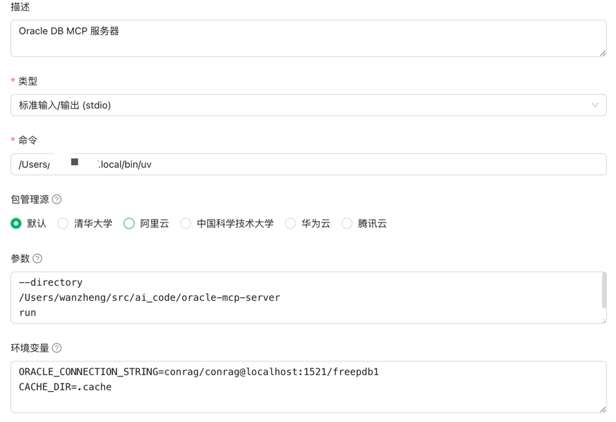
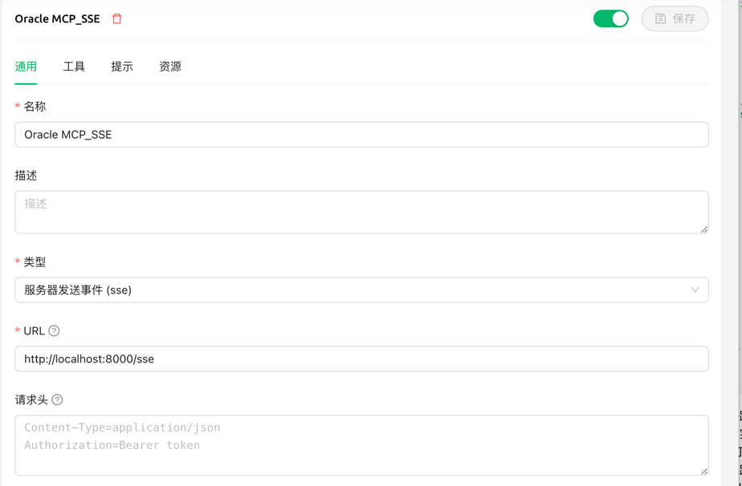

# MCP Server - Oracle DB Context

[English](README.md) | [中文](README-zh.md)

A powerful Model Context Protocol (MCP) server that provides contextual database schema information for large Oracle databases, enabling AI assistants to understand and work with databases containing thousands of tables.

## Table of Contents
- [Overview](#overview)
- [Features](#features)
- [Usage](#usage)
   - [Integration with GitHub Copilot in VSCode Insiders](#integration-with-github-copilot-in-vscode-insiders)
      - [Option 1: Using Docker (Recommended)](#option-1-using-docker-recommended)
      - [Option 2: Using UV (Local Installation)](#option-2-using-uv-local-installation)
   - [Starting the Server locally](#starting-the-server-locally)
   - [Available Tools](#available-tools)
- [Architecture](#architecture)
- [Connection Modes](#connection-modes)
   - [Thin Mode (Default)](#thin-mode-default)
   - [Thick Mode](#thick-mode)
- [System Requirements](#system-requirements)
- [Performance Considerations](#performance-considerations)
- [Contributing](#contributing)
- [License](#license)
- [Support](#support)

## Overview

The MCP Oracle DB Context server solves a critical challenge when working with very large Oracle databases: how to provide AI models with accurate, relevant database schema information without overwhelming them with tens of thousands of tables and relationships.

By intelligently caching and serving database schema information, this server allows AI assistants to:
- Look up specific table schemas on demand
- Search for tables that match specific patterns
- Understand table relationships and foreign keys
- Get database vendor information

## Features

- **Smart Schema Caching**: Builds and maintains a local cache of your database schema to minimize database queries
- **Targeted Schema Lookup**: Retrieve schema for specific tables without loading the entire database structure
- **Table Search**: Find tables by name pattern matching
- **Relationship Mapping**: Understand foreign key relationships between tables
- **Oracle Database Support**: Built specifically for Oracle databases
- **MCP Integration**: Works seamlessly with GitHub Copilot in VSCode, Claude, ChatGPT, and other AI assistants that support MCP

## Usage

### Integration with GitHub Copilot in VSCode Insiders

To use this MCP server with GitHub Copilot in VSCode Insiders, follow these steps:

1. **Install VSCode Insiders**
   - Download and install the latest version of [VSCode Insiders](https://code.visualstudio.com/insiders/)

2. **Install GitHub Copilot Extension**
   - Open VSCode Insiders
   - Go to the Extensions marketplace
   - Search for and install "GitHub Copilot"

3. **Configure MCP Server**
   - **Recommended: [Using Docker](#option-1-using-docker-recommended)**
   - Alternative: [Using UV](#option-2-using-uv-local-installation)

4. **Enable Agent Mode**
   - Open Copilot chat in VSCode Insiders
   - Click on "Copilot Edits"
   - Choose "Agent mode"
   - Click the refresh button in the chat input to load the available tools

After completing these steps, you'll have access to all database context tools through GitHub Copilot's chat interface.

#### Option 1: Using Docker (Recommended)

In VSCode Insiders, go to your user or workspace `settings.json` file and add the following:

   ```json
   "mcp": {
       "inputs": [
        {
          "id": "db-password",
          "type": "promptString",
          "description": "Oracle DB Password",
          "password": true,
        }
      ],
       "servers": {
           "oracle": {
               "command": "docker",
               "args": [
                   "run",
                   "-i",
                   "--rm",
                   "-e",
                   "ORACLE_CONNECTION_STRING",
                   "-e",
                   "TARGET_SCHEMA",
                   "-e",
                   "CACHE_DIR",
                   "-e",
                   "THICK_MODE",
                   "dmeppiel/oracle-mcp-server"
               ],
               "env": {
                  "ORACLE_CONNECTION_STRING":"<db-username>/${input:db-password}@<host>:1521/<service-name>",
                  "TARGET_SCHEMA":"",
                  "CACHE_DIR":".cache",
                  "THICK_MODE":"",  // Optional: set to "1" to enable thick mode
                  "ORACLE_CLIENT_LIB_DIR":"" // Optional: in case you use thick mode and you want to set a non-default directory for client libraries
               }
           }
       }
   }
   ```

   When using Docker (recommended approach):
   - All dependencies are included in the container
   - Set `THICK_MODE=1` in the environment variables to enable thick mode if needed
   - If you use `THICK_MODE`, you can optionally set the path where Oracle Client libraries are installed with `ORACLE_CLIENT_LIB_DIR` if it differs from the default location. 

#### Option 2: Using UV (Local Installation)
   
   This option requires installing and setting up the project locally:

   1. **Prerequisites**
      - Python 3.12 or higher
      - Oracle database access
      - Oracle instant client (required for the `oracledb` Python package)

   2. **Install UV**
      ```bash
      # Install uv using curl (macOS/Linux)
      curl -LsSf https://astral.sh/uv/install.sh | sh

      # Or using PowerShell (Windows)
      irm https://astral.sh/uv/install.ps1 | iex
      ```
      Make sure to restart your terminal after installing uv.

   3. **Project Setup**
      ```bash
      # Clone repository
      git clone https://github.com/yourusername/oracle-mcp-server.git
      cd oracle-mcp-server

      # Create and activate virtual environment
      uv venv
      
      # Activate (On Unix/macOS)
      source .venv/bin/activate
      
      # Activate (On Windows)
      .venv\Scripts\activate

      # Install dependencies
      uv pip install -e .
      ```

   4. **Configure VSCode Settings**
      ```json
      "mcp": {
         "inputs": [
            {
               "id": "db-password",
               "type": "promptString",
               "description": "Oracle DB Password",
               "password": true,
            }
         ],
         "servers": {
            "oracle": {
                  "command": "/path/to/your/.local/bin/uv",
                  "args": [
                     "--directory",
                     "/path/to/your/oracle-mcp-server",
                     "run",
                     "main.py"
                  ],
                  "env": {
                     "ORACLE_CONNECTION_STRING":"<db-username>/${input:db-password}@<host>:1521/<service-name>",
                     "TARGET_SCHEMA":"",
                     "CACHE_DIR":".cache",
                     "THICK_MODE":"",  // Optional: set to "1" to enable thick mode
                     "ORACLE_CLIENT_LIB_DIR":"" // Optional: in case you use thick mode and if you want to set a non-default directory for client libraries
                  }
            }
         }
      }
      ```
   - Replace the paths with your actual uv binary path and oracle-mcp-server directory path

For both options:
- Replace the `ORACLE_CONNECTION_STRING` with your actual database connection string
- The `TARGET_SCHEMA` is optional, it will default to the user's schema
- The `CACHE_DIR` is optional, defaulting to `.cache` within the MCP server root folder

#### Option 3：Useing Cherry Studio
run by stdio


run by sse



### Starting the Server locally

To run the MCP server directly:

```bash
uv run main.py

or

python main.py --transport=sse
```

For development and testing:

```bash
# Install the MCP Inspector
uv pip install mcp-cli

# Test with MCP Inspector
mcp dev main.py

# Or install in Claude Desktop
mcp install main.py
```

### Available Tools

When connected to an AI assistant like GitHub Copilot in VSCode Insiders or Claude, the following tools will be available:

#### `get_table_schema`
Get detailed schema information for a specific table including columns, data types, nullability, and relationships.
Example:
```
Can you show me the schema for the EMPLOYEES table?
```

#### `get_tables_schema`
Get schema information for multiple tables at once. More efficient than calling get_table_schema multiple times.
Example:
```
Please provide the schemas for both EMPLOYEES and DEPARTMENTS tables.
```

#### `search_tables_schema`
Search for tables by name pattern and retrieve their schemas.
Example:
```
Find all tables that might be related to customers and show their schemas.
```

#### `rebuild_schema_cache`
Force a rebuild of the schema cache. Use sparingly as this is resource-intensive.
Example:
```
The database structure has changed. Could you rebuild the schema cache?
```

#### `get_database_vendor_info`
Get information about the connected Oracle database version and schema.
Example:
```
What Oracle database version are we running?
```

#### `search_columns`
Search for tables containing columns that match a specific term. Useful when you know what data you need but aren't sure which tables contain it.
Example:
```
Which tables have columns related to customer_id?
```

#### `get_pl_sql_objects`
Get information about PL/SQL objects like procedures, functions, packages, triggers, etc.
Example:
```
Show me all stored procedures that start with 'CUSTOMER_'
```

#### `get_object_source`
Retrieve the source code for a PL/SQL object. Useful for debugging and understanding database logic.
Example:
```
Can you show me the source code for the CUSTOMER_UPDATE_PROC procedure?
```

#### `get_table_constraints`
Get all constraints (primary keys, foreign keys, unique constraints, check constraints) for a table.
Example:
```
What constraints are defined on the ORDERS table?
```

#### `get_table_indexes`
Get all indexes defined on a table, helpful for query optimization.
Example:
```
Show me all indexes on the CUSTOMERS table.
```

#### `get_dependent_objects`
Find all objects that depend on a specified database object.
Example:
```
What objects depend on the CUSTOMER_VIEW view?
```

#### `get_user_defined_types`
Get information about user-defined types in the database.
Example:
```
Show me all custom types defined in the schema.
```

#### `get_related_tables`
Get all tables that are related to a specified table through foreign keys, showing both incoming and outgoing relationships.
Example:
```
What tables are related to the ORDERS table?
```
#### `read_query` 
执行SELECT查询
示例：
```
查询订单表记录？
```

#### `exec_ddl_sql` 
执行CREATE/ALTER/DROP操作
示例：
```
创建一个学生表，包括姓名，性别，出生日期，班级，入学时间？
```

#### `exec_dml_sql` 
执行INSERT/UPDATE/DELETE操作
示例：
```
为学生表插入100条数据
```

#### `exec_pro_sql` 
执行PL/SQL代码块

## Architecture

This MCP server employs a three-layer architecture optimized for large-scale Oracle databases:

1. **DatabaseConnector Layer**
   - Manages Oracle database connections and query execution
   - Implements connection pooling and retry logic
   - Handles raw SQL operations

2. **SchemaManager Layer**
   - Implements intelligent schema caching
   - Provides optimized schema lookup and search
   - Manages the persistent cache on disk

3. **DatabaseContext Layer**
   - Exposes high-level MCP tools and interfaces
   - Handles authorization and access control
   - Provides schema optimization for AI consumption

## Connection Modes

The database connector supports two connection modes:

### Thin Mode (Default)
By default, the connector uses Oracle's thin mode, which is a pure Python implementation. This mode is:
- Easier to set up and deploy
- Sufficient for most basic database operations
- More portable across different environments

### Thick Mode
For scenarios requiring advanced Oracle features or better performance, you can enable thick mode:
- When using Docker (recommended): Set `THICK_MODE=1` in the Docker environment variables
- When using local installation: Export `THICK_MODE=1` environment variable and ensure Oracle Client libraries, compatible with your system architecture and database version, are installed

You can specify a custom location for the Oracle Client libraries using the `ORACLE_CLIENT_LIB_DIR` environment variable. This is particularly useful when:
- You have Oracle Client libraries installed in non-standard locations
- You need to work with multiple Oracle Client versions on the same system
- You don't have administrative privileges to install Oracle Client in standard locations
- You need specific Oracle Client versions for compatibility with certain database features

Note: When using Docker, you don't need to worry about installing Oracle Client libraries as they are included in the container (Oracle Instant Client v23.7). The container supports Oracle databases versions 19c up to 23ai in both linux/arm64 and linux/amd64 architectures.

## System Requirements

- **Python**: Version 3.12 or higher (required for optimal performance)
- **Memory**: 4GB+ available RAM for large databases (10,000+ tables)
- **Disk**: Minimum 500MB free space for schema cache
- **Oracle**: Compatible with Oracle Database 11g and higher
- **Network**: Stable connection to Oracle database server

## Performance Considerations

- Initial cache building may take 5-10 minutes for very large databases
- Subsequent startups typically take less than 30 seconds
- Schema lookups are generally sub-second after caching
- Memory usage scales with active schema size

## Contributing

We welcome contributions! Please see our [Contributing Guidelines](CONTRIBUTING.md) for details.

## License

This project is licensed under the MIT License - see the [LICENSE](LICENSE) file for details.

## Support

For issues and questions:
- Create an issue in this GitHub repository